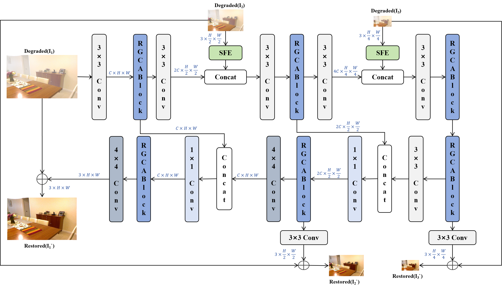
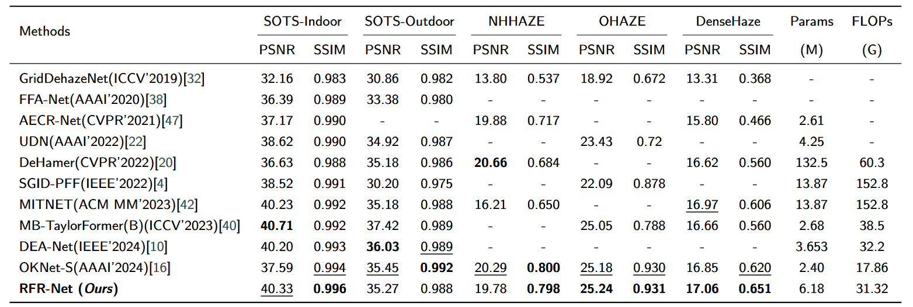
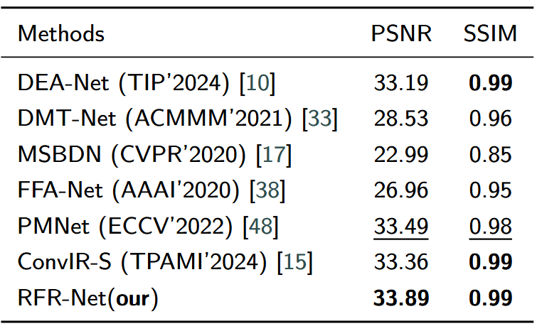
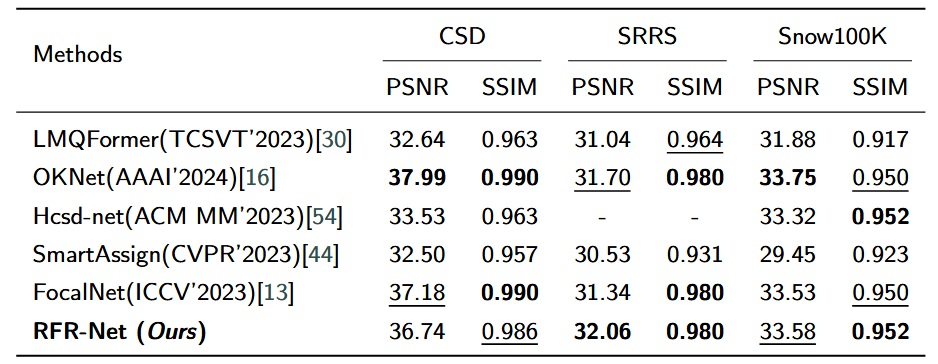

# RFR-Net: Residual Frequency Refinement Network for Image Restoration

RFR-Net is a PyTorch implementation for image dehazing and desnowing tasks. The network adopts an encoder-decoder architecture combined with residual attention mechanisms and frequency domain loss functions to achieve high-quality image restoration.

## Key Features

- Multi-scale feature extraction with progressive restoration
- Residual attention blocks for enhanced feature learning
- Joint spatial and frequency domain loss optimization
- Support for multiple datasets: ITS, OTS, Haze4K, DenseHaze, NHHAZE, OHAZE, Snow100K, SRRS, CSD
- Three model scales available: base, large
- Multi-resolution supervision with skip connections

## Network Architecture

RFR-Net adopts a symmetric encoder-decoder structure. The main architecture is shown below:



## Requirements

- Python 3.12
- PyTorch >= 1.8.0
- torchvision
- numpy
- Pillow
- tensorboard

Install dependencies:
```bash
pip install torch torchvision numpy Pillow tensorboard
```

Install learning rate warmup scheduler:
```bash
cd pytorch-gradual-warmup-lr
python setup.py install
```

## Dataset Preparation

### Dehazing Datasets

Download datasets:

Directory structure:
```
your_path/
├── reside-indoor/
│   ├── train/
│   │   ├── GT/
│   │   └── hazy/
│   └── test/
│       ├── GT/
│       └── hazy/
├── DenseHaze/
│   ├── train/
│   │   ├── gt/
│   │   └── hazy/
│   └── dense/
│       ├── Gt/
│       └── hazy/
└── Haze4K/
    ├── train/
    │   ├── GT/
    │   └── IN/
    └── test/
        ├── GT/
        └── IN/
```

### Desnowing Datasets

Directory structure:
```
your_path/
├── SRRS/
│   ├── train/
│   │   ├── gt/
│   │   └── snow/
│   └── dense/
│       ├── gt/
│       └── snow/
├── CSD/
└── Snow100K/
```

## Training

### Image Dehazing

Train on ITS dataset:
```bash
cd Dehazing/ITS
python main.py \
  --mode train \
  --version small \
  --data ITS \
  --data_dir /path/to/reside-indoor \
  --batch_size 8 \
  --learning_rate 1e-4 \
  --num_epoch 1000 \
  --save_freq 20 \
  --valid_freq 20
```

### Model Scales

- `base`: 4 residual blocks per stage (balanced)
- `large`: 16 residual blocks per stage (high capacity)

## Testing

### Dehazing

```bash
cd Dehazing/ITS
python main.py \
  --mode dense \
  --data ITS \
  --data_dir /path/to/reside-indoor \
  --test_model /path/to/model.pkl \
  --save_image True
```

## Project Structure

```
RFR-Net/
├── Dehazing/
│   ├── ITS/              # Indoor Training Set experiments
│   │   ├── models/       # Model definitions
│   │   │   ├── RFR.py    # RFR-Net main network
│   │   │   └── layers.py # Network layer definitions
│   │   ├── data/         # Data loading and augmentation
│   │   ├── main.py       # Program entry point
│   │   ├── train.py      # Training logic
│   │   └── eval.py       # Evaluation logic
│   └── OTS/              # Outdoor Training Set experiments
├── Image_desnowing/      # Desnowing experiments
│   ├── models/
│   │   ├── RFR.py
│   │   └── layers.py
│   ├── data/
│   ├── main.py
│   ├── train.py
│   └── eval.py
├── pytorch-gradual-warmup-lr/  # Learning rate warmup scheduler
├── calculate_para_flops.py     # Model complexity analysis
└── calculate_psnr.py           # PSNR calculation tool
```


## License

This project is licensed under the MIT License. See the LICENSE file for details.

## Results and Notes

- 
- 
- 说明：SOTS-Outdoor 的评测是在 `RFR-L (Large)` 模型下进行；其余数据集/结果的评测均使用 `RFR-B (Base)` 模型。
- 

**Note:** SOTS-Outdoor was evaluated using the `RFR-L (Large)` model; other evaluations used the `RFR-B (Base)` model.
